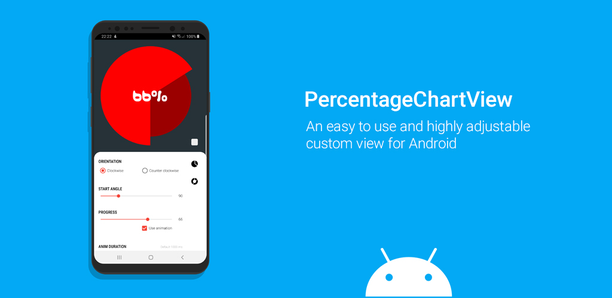
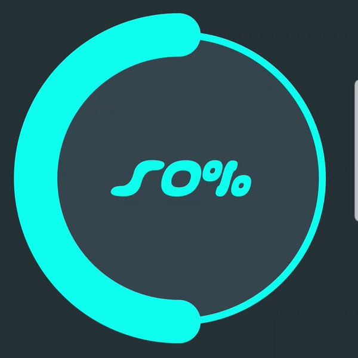
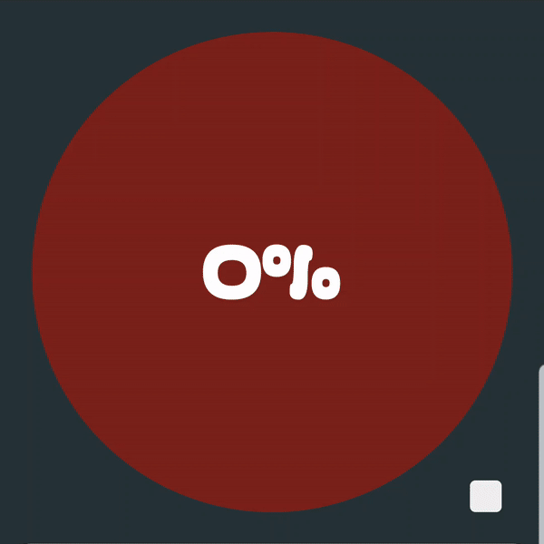
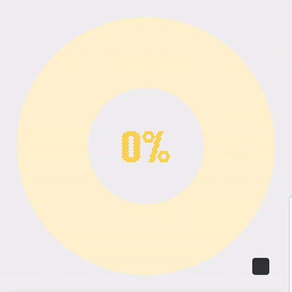
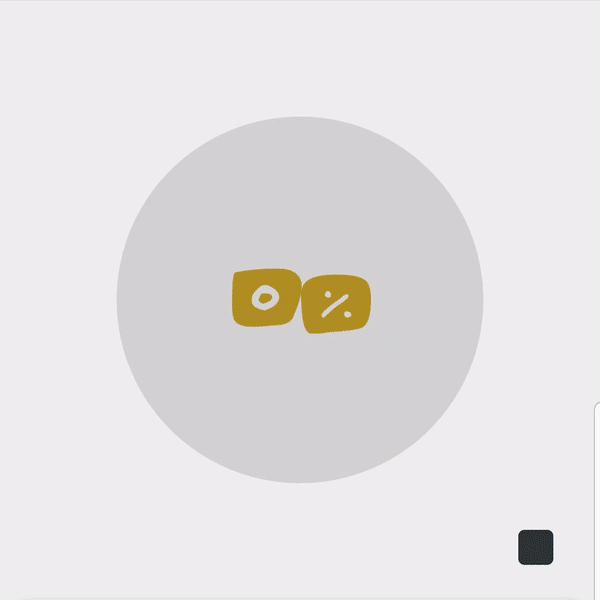

# Percentage Chart View
[](https://app.codacy.com/app/RamiJ3mli/PercentageChartView?utm_source=github.com&utm_medium=referral&utm_content=RamiJ3mli/PercentageChartView&utm_campaign=Badge_Grade_Dashboard)
[](http://developer.android.com/index.html)
[](https://android-arsenal.com/api?level=16)
[  ](https://bintray.com/ramijemli/PercentageChartView/com.ramijemli.percentagechartview/0.2.0/link)
[](https://android-arsenal.com/details/1/7600)
[](http://twitter.com/rami_jemli)<br/>
<br/><br/>

A Java-based easy to use and highly adjustable custom view that displays the progress of a single given task.
<br/>Please feel free to see the library in action in a showcase app available on Google play.

<a href="https://play.google.com/store/apps/details?id=com.ramijemli.percentagechartview"></a>


  <br/>   <br/>   

## SETUP
Dependency should be declared in your app module level  `build.gradle` file:  
  
```  
dependencies {    

    implementation 'com.ramijemli.percentagechartview:percentagechartview:0.2.0' 
    
}  
```  

## HOW TO USE
```  
    <com.ramijemli.percentagechartview.PercentageChartView
        android:id="@+id/view_id"
        android:layout_width="match_parent"
        android:layout_height="match_parent"
        app:pcv_mode="pie"
        app:pcv_orientation="counter_clockwise"
        app:pcv_animDuration="800"
        app:pcv_animInterpolator="anticipate_overshoot"
        app:pcv_progress="10"
        app:pcv_startAngle="90"/>
  ```  

### Attributes
|Name|Format|Default|Supported modes|Description| 
|---|:---:|:---:|:---:|---| 
| `pcv_mode` | `enum` | `pie` |-| Sets percentage chart appearance to **`"ring"`** or **`"pie"`**.
| `pcv_orientation` | `enum` | `clockwise` |Both| Sets progress's drawing direction to **`"clockwise"`** or **`"counter_clockwise"`**.
| `pcv_startAngle` | `integer` | `0` |Both| Sets progress's drawing start angle to **[0..360]**.
| `pcv_animDuration` | `integer` |  `400` |Both| Sets progress update's animation duration. 
| `pcv_animInterpolator` | `enum` | `linear` |Both| Sets progress update's animation interpolator to **`"linear"`**, **`"accelerate"`**, **`"decelerate"`**, **`"accelerate_decelerate"`**, **`"anticipate"`**, **`"overshoot"`**, **`"anticipate_overshoot"`**, **`"bounce"`**, **`"fast_out_linear_in"`**, **`"fast_out_slow_in"`**, **`"linear_out_slow_in"`**.    
| `pcv_drawBackground` | `boolean` | `true` for pie mode <br/>`false` for ring mode|Both| Sets whether to draw background or not. 
| `pcv_backgroundColor` | `color` | `#000000` |Both| Sets background color.
| `pcv_progress` | `integer` |  `0` |Both| Sets current progress.
| `pcv_progressColor` | `color` | Accent color |Both| Sets progress color. 
| `pcv_textColor` | `color` | `#ffffff` |Both| Sets text color.
| `pcv_textSize` | `dimension` | `#12sp` | Both| Sets text size in SP.
| `pcv_typeface` | `string` |  System font | Both| Sets progress text's typeface file path in assets folder.
| `pcv_textStyle` | `flag` | `normal` | Both| Sets progress text's style to **`"normal"`**, **`"bold"`**, **`"italic"`**, **`"bold\|italic"`**.
| `pcv_textShadowColor` |  `color` | `#00ffffff` | Both | Sets text shadow/glow color.
| `pcv_textShadowRadius` | `string` | `0` | Both | Sets text shadow/glow radius.
| `pcv_textShadowDistX` | `float` | `0` | Both | Sets text shadow/glow's x-axis distance.
| `pcv_textShadowDistY` | `float` | `0` | Both | Sets text shadow/glow's y-axis distance.
| `pcv_backgroundOffset` | `dimension` | `0dp` | Pie | Sets a margin only for background.
| `pcv_drawBackgroundBar` | `boolean` | `true` | Ring | Sets whether to draw background bar or not.    
| `pcv_backgroundBarThickness` | `dimension` | `16dp` | Ring | Sets background bar's thickness in DP.
| `pcv_backgroundBarColor` | `color` | `#000000` | Ring | Sets background color.
| `pcv_progressBarThickness` | `dimension` | `16dp` | Ring |Sets progress bar's thickness in DP.
| `pcv_progressBarStyle` | `enum` | `round` | Ring | Sets progress bar's style to **`"round"`** or **`"square"`**.
| `pcv_adaptiveText` | `boolean` | `false` | Both | Makes the text color synchronize with progress color. If **`true`**, text color will be 50% lighter than progress color. This works only when an **`AdaptiveColorProvider`** is used.
| `pcv_adaptiveTextMode` | `enum` | `lighter` | Both | Changes whether text color should be darker or lighter than progress color. It accepts **`"darker"`** or **`"lighter"`** and this works only when an **`AdaptiveColorProvider`** is used.
| `pcv_adaptiveTextRatio` | `integer` | `50` | Both | Changes how much darker or lighter text color should be. It accepts values from to **[0..100]** and this works only when an **`AdaptiveColorProvider`** is used.
| `pcv_adaptiveBackground` | `boolean` | `false` | Both | Makes the background color synchronize with progress color. If **`true`**, background color will be 50% darker than progress color. This works only when an **`AdaptiveColorProvider`** is used.
| `pcv_adaptiveBackgroundMode` | `enum` | `darker` | Both | Changes whether background color should be darker or lighter than progress color. It accepts **`"darker"`** or **`"lighter"`** and this works only when an **`AdaptiveColorProvider`** is used.
| `pcv_adaptiveBackgroundRatio` | `integer` | `50` | Both | Changes how much darker or lighter background color should be. It accepts values from to **[0..100]** and this works only when an **`AdaptiveColorProvider`** is used.
| `pcv_adaptiveBackgroundBar` | `boolean` | `false` | Ring | Makes the background bar color synchronize with progress color. If **`true`**, background bar color will be 50% darker than progress color. This works only when an **`AdaptiveColorProvider`** is used.
| `pcv_adaptiveBackgroundBarMode` | `enum` | `darker` | Ring | Changes whether background bar color should be darker or lighter than progress color. It accepts **`"darker"`** or **`"lighter"`** and this works only when an **`AdaptiveColorProvider`** is used.
| `pcv_adaptiveBackgroundBarRatio` | `integer` | `50` | Ring | Changes how much darker or lighter background bar color should be. It accepts values from to **[0..100]** and this works only when an **`AdaptiveColorProvider`** is used.

All xml attributes have their Java counterparts except the `pcv_mode` attribute (for now).

### Progress-based adaptive colors

To use the color per progress feature, you have to pass a **`AdaptiveColorProvider`** class using the **`setAdaptiveColorProvider()`** method.

``` 
PercentageChartView chart = findViewById(R.id.chart);  
chart.setOnClickListener(view -> chart.setPercentage(new Random().nextInt(100), true));  
chart.setAdaptiveColorProvider(value -> {  
    String color;  

    if (value <= 25)  
        color ="#F44336";  
    else if (value <= 50)  
        color = "#FFB300";  
    else if (value <= 75)  
        color = "#00E676";  
    else  color = "#18FFFF";  
   
    return Color.parseColor(color);  
});
``` 
### Progress changed listener

It's possible to get progress updates by setting an **`OnProgressChangeListener`**.
``` 
chart.setOnProgressChangeListener(new PercentageChartView.OnProgressChangeListener() {
    @Override
    public void onProgressChanged(float progress) {
        Log.d(TAG, String.valueOf(progress));
    }
});
``` 

## To do
- [x] ~~Initial release~~  
- [x] ~~Progress based adaptive color support~~ 
- [x] ~~Text style support~~ 
- [x] ~~Filled background support for ring mode~~  
- [x] ~~Text typeface support~~  
- [x] ~~Progress change listener~~  
- [x] ~~Progress based adaptive color support for text, background and background bar~~
- [x] ~~Draw orientation support~~
- [x] ~~Text shadow/glow support~~
- [ ] Demo app optimization using a RecyclerView  
- [ ] Background bar and progress bar offset support  
- [ ] Text formatter support  
- [ ] Gradient colors support  
- [ ] Builder pattern based update pipeline  
- [ ] New mode/appearance
- [ ] Segmented style support for ring mode  

## CONTRIBUTION
All bugs, feature requests, feedback, etc. are welcome. Please, feel free to [create an issue](https://github.com/RamiJ3mli/PercentageChartView/issues).  

You can contribute by opening pull requests on dev branch. Please try to push commits per feature for a clean commit history.

## APPS USING IT
Are you using this library in your app? Let us know and we'll show it here.

## CONTRIBUTORS    
<table>    
<tr>    
<td>    
<a href="https://github.com/RamiJ3mli"></a><br /><sub><center><b>Rami Jemli</b></center></sub>    
</td>    
</tr>    
</table>    

## LICENSE    
``` 
Copyright 2019 Rami Jemli

Licensed under the Apache License, Version 2.0 (the "License");
you may not use this file except in compliance with the License.
You may obtain a copy of the License at

http://www.apache.org/licenses/LICENSE-2.0

Unless required by applicable law or agreed to in writing, 
software distributed under the License is distributed on an "AS IS" BASIS, 
WITHOUT WARRANTIES OR CONDITIONS OF ANY KIND, either express or implied. 
See the License for the specific language governing permissions 
and limitations under the License.
``` 
