# Percentage Chart View
## [Attention] This library is deprecated and will not be maintained anymore.
[](https://android-arsenal.com/api?level=16)
[](https://bintray.com/ramijemli/PercentageChartView/com.ramijemli.percentagechartview/0.3.1/link)
[](https://www.codacy.com/app/RamiJ3mli/PercentageChartView?utm_source=github.com&amp;utm_medium=referral&amp;utm_content=RamiJ3mli/PercentageChartView&amp;utm_campaign=Badge_Grade)
[](https://android-arsenal.com/details/1/7600)
[](http://twitter.com/rami_jemli)
<br/>
<br/>
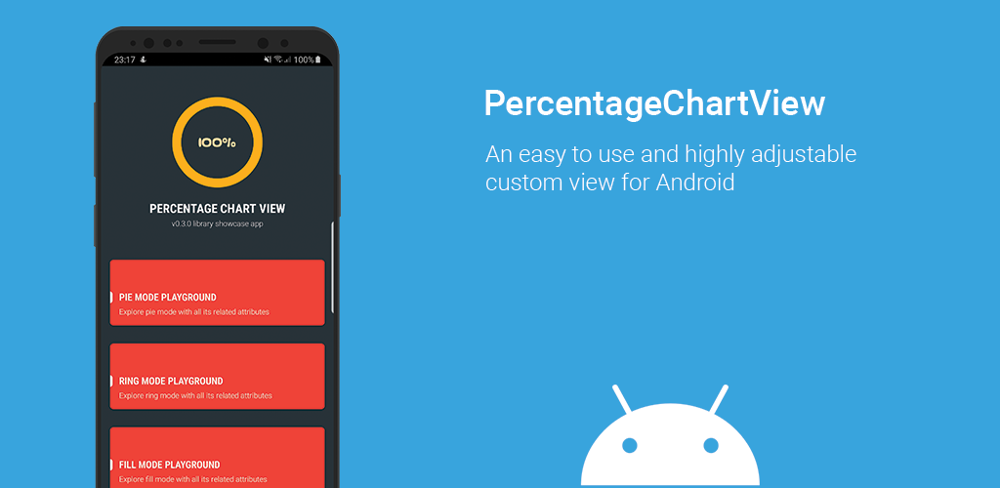
<br/>

A Java-based easy to use and highly adjustable custom view that displays the progress of a single given task.
<br/>Please feel free to see the library in action in a showcase app available on Google play. This will help you check if a certain design can be achieved.

<a href="https://play.google.com/store/apps/details?id=com.ramijemli.percentagechartview"></a>

## RING MODE
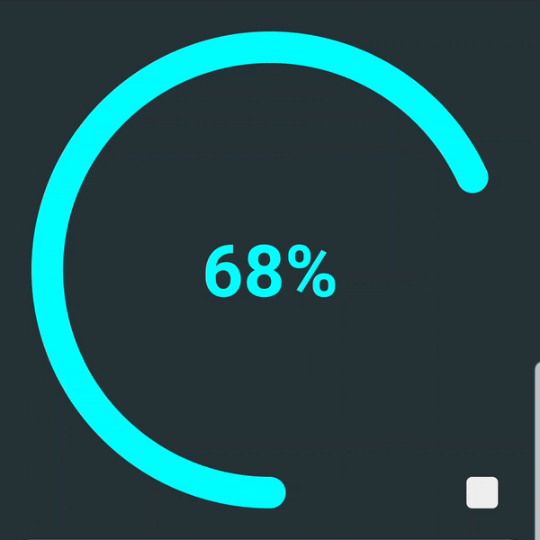  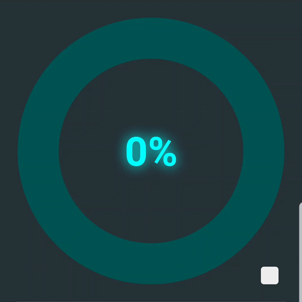    <br/>  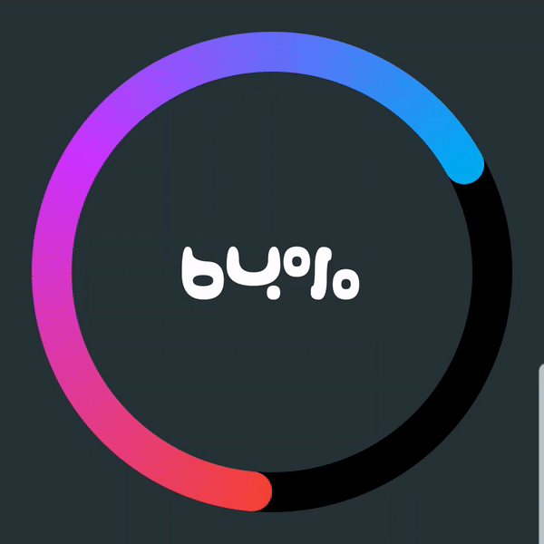<br/>

## PIE MODE
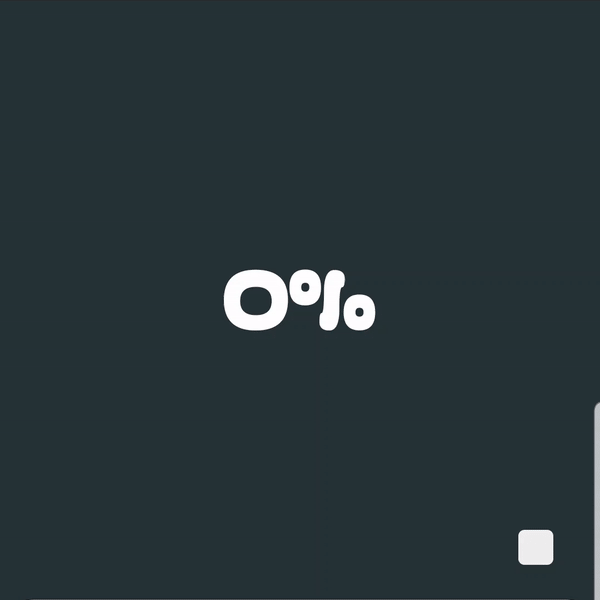    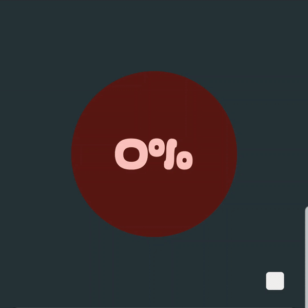  <br/>  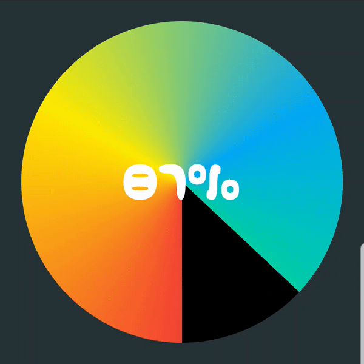<br/>

## FILL MODE
  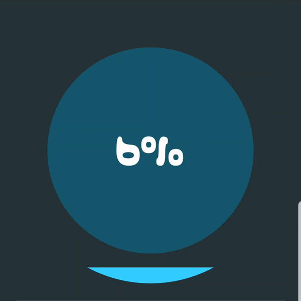  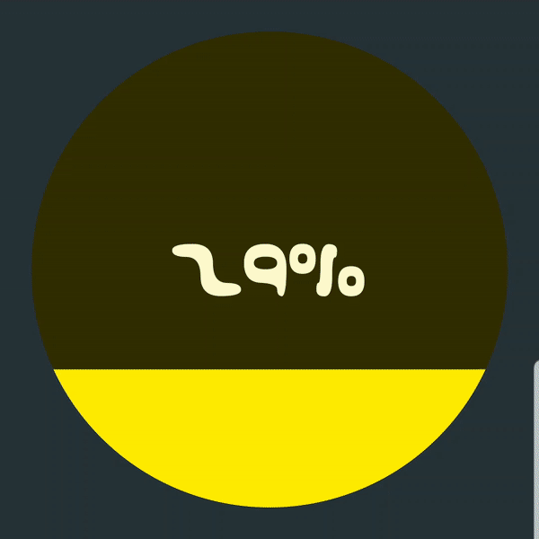  <br/>  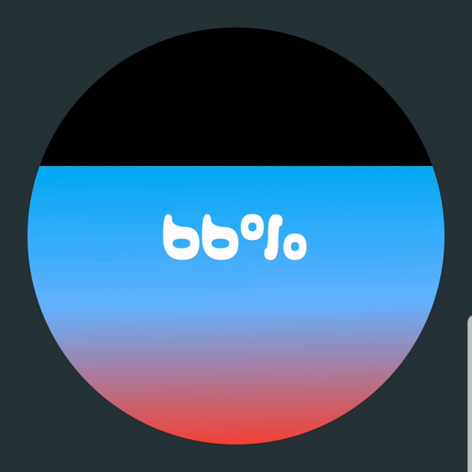<br/>

## SETUP
Dependency should be declared in your app module level  `build.gradle` file:  
  
```  
dependencies {    

    implementation 'com.ramijemli.percentagechartview:percentagechartview:0.3.1' 
    
}  
```  

## HOW TO USE
```  
    <com.ramijemli.percentagechartview.PercentageChartView
        android:id="@+id/view_id"
        android:layout_width="match_parent"
        android:layout_height="match_parent"
        app:pcv_mode="pie"
        app:pcv_orientation="counter_clockwise"
        app:pcv_animDuration="800"
        app:pcv_animInterpolator="anticipate_overshoot"
        app:pcv_progress="10"
        app:pcv_startAngle="90"/>
  ```  

### Attributes  
| Name | Format | Default | Supported modes | Description |
| --- | :---: | :---: | :---: | --- | 
| `pcv_mode` | `enum` | `pie` | - | Sets percentage chart appearance to **`"ring"`**, **`"pie"`**, or **`"fill"`**. |  
| `pcv_orientation` | `enum` | `clockwise` | Pie, Ring | Sets progress's drawing direction to **`"clockwise"`** or **`"counter_clockwise"`**. |  
| `pcv_startAngle` | `integer` | `0` | All | Sets progress's drawing start angle to **\[0..360]**. |  
| `pcv_animDuration` | `integer` | `400` | All | Sets progress update's animation duration. |  
| `pcv_animInterpolator` | `enum` | `linear` | All | Sets progress update's animation interpolator to **`"linear"`**, **`"accelerate"`**, **`"decelerate"`**, **`"accelerate_decelerate"`**, **`"anticipate"`**, **`"overshoot"`**, **`"anticipate_overshoot"`**, **`"bounce"`**, **`"fast_out_linear_in"`**, **`"fast_out_slow_in"`**, **`"linear_out_slow_in"`**. | 
| `pcv_drawBackground` | `boolean` | `true` for pie mode <br/>`false` for ring mode | All | Sets whether to draw background or not. |  
| `pcv_backgroundColor` | `color` | `#000000` | All | Sets background color. |  
| `pcv_progress` | `integer` | `0` | All | Sets current progress. |  
| `pcv_progressColor` | `color` | Accent color | All | Sets progress color. |  
| `pcv_textColor` | `color` | `#ffffff` | All | Sets text color. |  
| `pcv_textSize` | `dimension` | `#12sp` | All | Sets text size in SP. |  
| `pcv_typeface` | `string` | System font | All | Sets progress text's typeface file path in assets folder. |  
| `pcv_textStyle` | `flag` | `normal` | All | Sets progress text's style to **`"normal"`**, **`"bold"`**, **`"italic"`**, **`"bold\|italic"`**. |  
| `pcv_textShadowColor` |  `color` | `#00ffffff` | All | Sets text shadow/glow color. |  
| `pcv_textShadowRadius` | `string` | `0` | All | Sets text shadow/glow radius. |  
| `pcv_textShadowDistX` | `float` | `0` | All | Sets text shadow/glow's x-axis distance. |  
| `pcv_textShadowDistY` | `float` | `0` | All | Sets text shadow/glow's y-axis distance. |  
| `pcv_backgroundOffset` | `dimension` | `0dp` | Pie, Fill | Sets a margin only for background. |  
| `pcv_drawBackgroundBar` | `boolean` | `true` | Ring | Sets whether to draw background bar or not. |  
| `pcv_backgroundBarThickness` | `dimension` | `16dp` | Ring | Sets background bar's thickness in DP. |  
| `pcv_backgroundBarColor` | `color` | `#000000` | Ring | Sets background color. |  
| `pcv_progressBarThickness` | `dimension` | `16dp` | Ring | Sets progress bar's thickness in DP. |  
| `pcv_progressBarStyle` | `enum` | `round` | Ring | Sets progress bar's style to **`"round"`** or **`"square"`**. |  
| `pcv_gradientType` | `enum` | - | All | Sets the gradient colors' type for progress to **`"linear"`**, **`"radial"`**, or **`"sweep"`**. (sweep is not supported for fill mode) |  
| `pcv_gradientColors` | `string` | - | All | Sets the gradient colors for progress in a comma separated hex color values format; **`"#F44336 , #2196F3 , #00BCD4"`**. |  
| `pcv_gradientDistributions` | `string` | - | All | Sets the gradient colors' distribution in a comma separated float values format; **`"0.2 , 0.5 , 0.8"`**.<br/> Values must be monotonic and belong to **\[0..1]**. If ignored colors will be distributed evenly.  |  
| `pcv_gradientAngle` | `integer` | `pcv_startAngle` | All | Sets linear gradient colors' drawing angle to **\[0..360]**. |  

### Start angle
`pcv_startAngle` and `pcv_gradientAngle` attributes accept values following the next illustration.

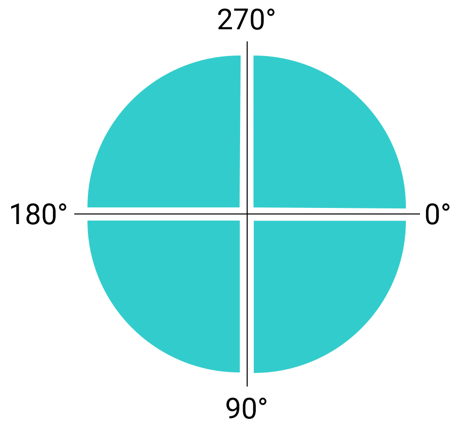

### Fluent API
All XML attributes have their Java counterparts except the `pcv_mode` attribute (for now).

Updates can be set by making the changes and calling  `apply()`. This will make sure to redraw the view only once at the end.

    mChart.textColor(Color.BLACK)  
          .textSize(sizeSp)  
          .typeface(typeface)  
          .textShadow(Color.WHITE, 2f, 2f, 2f)  
          .progressColor(Color.RED)  
          .backgroundColor(Color.BLACK)  
          .apply();
For a single update, you can call the needed setter method. e.g.  `setTextSize(sizeSp)`.

### Progress-based adaptive colors
To use the color per progress feature, you have to pass an **`AdaptiveColorProvider`** class using the **`setAdaptiveColorProvider()`** method. <br/>
Adaptive colors can be applied to progress, background, text, and background bar. <br/>
It's worth mentioning that gradient colors have a higher priority than the provided colors, and that you can ignore redefining the methods you don't need as they have an implementation by default.
  
``` 
AdaptiveColorProvider colorProvider = new AdaptiveColorProvider() {  
    @Override  
    public int provideProgressColor(float progress) {  
        if (progress <= 25)  
            return colorOne;  
        else if (progress <= 50)  
            return colorTwo;  
        else if (progress <= 75)  
            return colorThree;  
        else return colorFour;  
    }
  
    @Override  
    public int provideBackgroundColor(float progress) {  
		//This will provide a bg color that is 80% darker than progress color.
        return ColorUtils.blendARGB(provideProgressColor(progress), Color.BLACK, .8f);  
    }  
  
    @Override  
    public int provideTextColor(float progress) {  
        return provideProgressColor(progress);  
    }
  
    @Override  
    public int provideBackgroundBarColor(float progress) {  
        return ColorUtils.blendARGB(provideProgressColor(progress), Color.BLACK, .5f);  
    }  
};

mPieChart.setAdaptiveColorProvider(colorProvider);
```

### Progress changed listener
It's possible to get progress updates by setting an **`OnProgressChangeListener`**.
``` 
chart.setOnProgressChangeListener(new PercentageChartView.OnProgressChangeListener() {
    @Override
    public void onProgressChanged(float progress) {
        Log.d(TAG, String.valueOf(progress));
    }
});
``` 

### Text formatter
For text, you can use another unit instead of percentage. You have to pass a **`ProgressTextFormatter`** class using the **`setTextFormatter()`** method. <br/>
``` 
mRingChart.setTextFormatter(new ProgressTextFormatter() {  
    @Override  
    public String provideFormattedText(float progress) {  
        int days = (int) (progress * maxDays / 100);  
        return days + " days";  
    }  
});
```

## TO DO
-   [x] ~~Initial release~~  
-   [x] ~~Progress based adaptive color support~~ 
-   [x] ~~Text style support~~ 
-   [x] ~~Filled background support for ring mode~~  
-   [x] ~~Text typeface support~~  
-   [x] ~~Progress change listener~~  
-   [x] ~~Progress based adaptive color support for text, background and background bar~~
-   [x] ~~Draw orientation support~~
-   [x] ~~Text shadow/glow support~~
-   [ ] Background bar and progress bar offset support  
-   [x] ~~Text formatter support~~
-   [x] ~~Gradient colors support~~ 
-   [x] ~~Builder pattern based update pipeline~~
-   [x] ~~New mode/appearance~~
-   [ ] Segmented style support for ring mode  
-   [ ] SpannableString support  

## CONTRIBUTION
All bugs, feature requests, feedback, etc. are welcome. Please, feel free to [create an issue](https://github.com/RamiJ3mli/PercentageChartView/issues).  

You can contribute by opening pull requests on dev branch. Please try to push commits per feature for a clean commit history.

## APPS USING IT
Are you using this library in your app? Let us know and we'll show it here.

## CONTRIBUTORS    
<table>    
<tr>    
<td>    
<a href="https://github.com/RamiJ3mli"></a><br /><sub><center><b>Rami Jemli</b></center></sub>    
</td>    
</tr>    
</table>    

## LICENSE    
``` 
Copyright 2019 Rami Jemli

Licensed under the Apache License, Version 2.0 (the "License");
you may not use this file except in compliance with the License.
You may obtain a copy of the License at

    http://www.apache.org/licenses/LICENSE-2.0

Unless required by applicable law or agreed to in writing, 
software distributed under the License is distributed on an "AS IS" BASIS, 
WITHOUT WARRANTIES OR CONDITIONS OF ANY KIND, either express or implied. 
See the License for the specific language governing permissions 
and limitations under the License.
``` 
