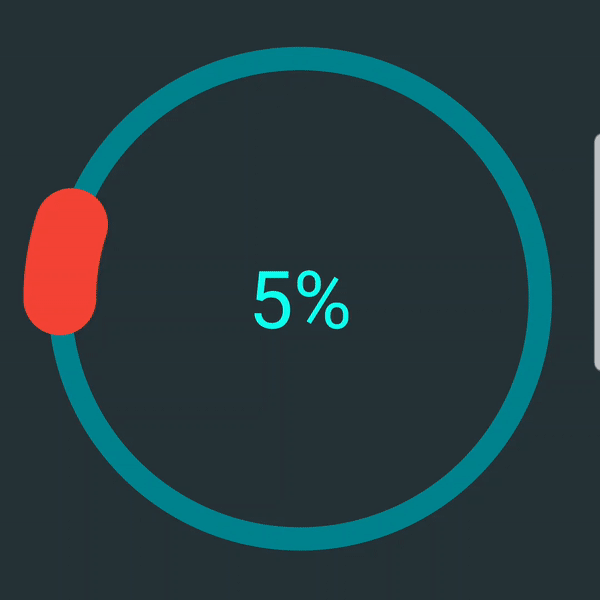

# Percentage Chart View
A customizable Android percentage chart that displays the progress of any single given task or information.    
  


## Setup
Dependency should be declared in your app module level  `build.gradle` file:  
  
```  
dependencies {    
    implementation 'com.ramijemli.percentagechartview:percentagechartview:0.1.1' 
}  
```  

## How to use

```  
<com.ramijemli.percentagechartview.PercentageChartView  
    android:id="@+id/chart"  
    android:layout_width="match_parent"  
    android:layout_height="match_parent"  
    app:pcv_animDuration="800"  
    app:pcv_animInterpolator="accelerate_decelerate"  
    app:pcv_backgroundColor="#00838F"  
    app:pcv_mode="ring"  
    app:pcv_percentageColor="#0ffff0"  
    app:pcv_percentageWidth="50dp"  
    app:pcv_startAngle="180"  
    app:pcv_textColor="#0ffff0"  
    app:pcv_textSize="50sp" />  
  ```  

To use the color per progress feature, you have to pass a ColorProvider class using the setColorProvider() method.

``` 
PercentageChartView chart = findViewById(R.id.chart);  
chart.setOnClickListener(view -> chart.setPercentage(new Random().nextInt(100), true));  
chart.setColorProvider(value -> {  
    String color;  

    if (value <= 25)  
        color ="#F44336";  
    else if (value <= 50)  
        color = "#FFB300";  
    else if (value <= 75)  
        color = "#00E676";  
    else  color = "#18FFFF";  
   
    return Color.parseColor(color);  
});
``` 

## Attributes
|Name|Format|Description| 
|---|:---:|---| 
| `pcv_mode` | `enum` | Set percentage chart appearance to **`"ring"`** or **`"pie"`** | `pcv_orientation` | `enum` | Set progress bar's direction to **`"clockwise"`** or **`"counter_clockwise"`** 
| `pcv_startAngle` | `integer` | Set progress bar's start angle to **[0..360]** 
| `pcv_backgroundColor` | `color` | Change progress background color    
| `pcv_backgroundWidth` | `dimension` | set progress background bar width **if `pcv_mode="ring"`** 
| `pcv_percentageColor` | `color` | Change progress foreground color    
| `pcv_percentageWidth` | `dimension` | set progress foreground bar width **if `pcv_mode="ring"`** 
| `pcv_percentageStyle` | `enum` | Change progress foreground bar style to **`"round"`** or **`"square"`** 
| `pcv_textColor` | `color` | Change text color    
| `pcv_textSize` | `dimension` | Set text size in SP    
| `pcv_animDuration` | `integer` | Set progress update's animation duration    
| `pcv_animInterpolator` | `enum` | Set progress update's animation interpolator to **`"linear"`** (default), **`"accelerate"`**, **`"decelerate"`**, **`"accelerate_decelerate"`**, **`"anticipate"`**, **`"overshoot"`**, **`"anticipate_overshoot"`**, **`"bounce"`**, **`"fast_out_linear_in"`**, **`"fast_out_slow_in"`**, **`"linear_out_slow_in"`**.    

## To do
- [x] ~~Initial release~~  
- [x] ~~Progress based adaptive color support~~ 
- [ ] Color states support  
- [ ] Filled background support for ring mode  
- [ ] Text typeface support  
- [ ] New mode/appearance  
- [ ] Dynamic text suffix support  
- [ ] Text formatter support  
- [ ] Gradient colors support  
- [ ] Component's lifecycle awareness  
- [ ] Segmented progress support for ring mode  

## Feedback    
All bugs, feature requests, pull requests, feedback, etc. are welcome. Please, feel free to [create an issue](https://github.com/RamiJ3mli/PercentageChartView/issues).  

## Contributors    
<table>    
<tr>    
<td>    
<a href="https://github.com/RamiJ3mli"></a><br /><sub><center><b>Rami Jemli</b></center></sub>    
</td>    
</tr>    
</table>    

## License    

 Copyright 2019 Rami Jemli<br/>
 Licensed under the Apache License, Version 2.0 (the "License"); you may not use this file except in compliance with the License. You may obtain a copy of the License at    
 http://www.apache.org/licenses/LICENSE-2.0<br/>
 Unless required by applicable law or agreed to in writing, software distributed under the License is distributed on an "AS IS" BASIS, WITHOUT WARRANTIES OR CONDITIONS OF ANY KIND, either express or implied. See the License for the specific language governing permissions and limitations under the License.<br/>
